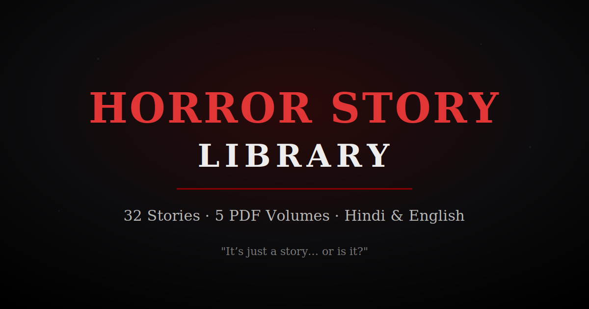

<p align="center">
  
</p>

# Horror Story Library

A curated archive of **32 animated-style horror story transcripts** (Hindi & English), preserved verbatim and compiled into clean, print-ready PDF volumes.

[](transcripts/)
[](docs/)
[](docs/)
[](LICENSE)

---

## Description

This repository preserves the **complete, unedited transcripts** of 32 horror stories exactly as supplied (including the original timestamps), then renders them into searchable, bookmarked PDF volumes with full Devanagari (Hindi) typography.

- **100% content preserved** — no summarizing, compression, or rewriting.
- **Devanagari + Latin** rendered correctly via HarfBuzz text shaping (Noto fonts).
- Each PDF includes a **cover page, Table of Contents with page numbers, PDF bookmarks, and page-number footers**.
- Story 13 is an exact duplicate of Story 12 in the source batch and is **flagged but preserved** per the archive rules.

## Story Ranges & PDF Library

| Volume | Stories | File |
|--------|---------|------|
| Volume 1 | 01–07 | [`docs/YOUTUBE TRANSCRIPT 1-7.pdf`](docs/YOUTUBE%20TRANSCRIPT%201-7.pdf) |
| Volume 2 | 08–17 | [`docs/YOUTUBE TRANSCRIPT 8-17.pdf`](docs/YOUTUBE%20TRANSCRIPT%208-17.pdf) |
| Volume 3 | 18–27 | [`docs/YOUTUBE TRANSCRIPT 18-27.pdf`](docs/YOUTUBE%20TRANSCRIPT%2018-27.pdf) |
| Volume 4 | 28–32 | [`docs/YOUTUBE TRANSCRIPT 28-32.pdf`](docs/YOUTUBE%20TRANSCRIPT%2028-32.pdf) |
| Complete Library | 01–32 | [`docs/YOUTUBE TRANSCRIPT COMPLETE LIBRARY.pdf`](docs/YOUTUBE%20TRANSCRIPT%20COMPLETE%20LIBRARY.pdf) |

### Story Index

| # | Title | # | Title |
|---|-------|---|-------|
| 01 | Bhakshini / भक्षिणी | 17 | रूम 333 (Langham Hotel — Annie) |
| 02 | This House Is Mine | 18 | काक तंत्र (The Crow Tantra — Ajitesh) |
| 03 | The Yogini's Curse | 19 | ओकीकू डॉल (The Okiku Doll) |
| 04 | The College Library Spirit | 20 | रोहतांग की लोरी (Rohtang Lullaby — Sahil) |
| 05 | The Dark Well Ritual (Andhakup) | 21 | कॉर्प्स ब्राइड (The Dead Bride — Mateo) |
| 06 | The River's Fish Ghost (Sugandha) | 22 | काल त्रिगोरी (Kaal Trigodi) |
| 07 | The Last Cab (Mahesh Patil) | 23 | 7 बजे का राज (Infrasound — Aryan) |
| 08 | मेरा बच्चा कहां है? (Anjali) | 24 | रूहानी कैद (Cursed Book — Sameer & Tara) |
| 09 | भूतों की बारात (Ghost Procession) | 25 | शांति निवास (Grief & Illusion — Mayank) |
| 10 | शाकचुन्नी (Shakchunni / Kalyani) | 26 | माया की आत्मा (Kulkarni House — Vedika) |
| 11 | कुएं वाली आत्मा / सती आसरा (Maya) | 27 | शैतान की भेंट (Jayant & Neelima) |
| 12 | आईना — Mirror Surgeon (Sameer) | 28 | मसान (The Massan — Anshika) |
| 13 | आईना — Mirror Surgeon *(dup of 12)* | 29 | आरे कॉलोनी का रिक्शा (Mohan & Reshma) |
| 14 | मोलक देवता (Aghoram & Molak) | 30 | एम्बुलेंस — दूल्हे की आत्मा (Raghu) |
| 15 | लबूबू डॉल (The Labubu Doll) | 31 | कशेड़ी घाट का चकवा (Akash & Pankaj) |
| 16 | अंतिम अर्पण (Royal Crescent — Rupa) | 32 | सती घाटी (Kamlesh & the Truck) |

## Folder Structure

```
Horror-Story-Library/
├── README.md
├── LICENSE
├── docs/                                  # Print-ready PDF volumes
│   ├── YOUTUBE TRANSCRIPT 1-7.pdf
│   ├── YOUTUBE TRANSCRIPT 8-17.pdf
│   ├── YOUTUBE TRANSCRIPT 18-27.pdf
│   ├── YOUTUBE TRANSCRIPT 28-32.pdf
│   └── YOUTUBE TRANSCRIPT COMPLETE LIBRARY.pdf
├── transcripts/                           # Source-of-truth, 1 markdown per story
│   ├── Story_01.md ... Story_32.md
├── reports/
│   ├── validation_report.md
│   └── completion_report.md
├── assets/
│   └── cover_images/cover.svg
└── build/                                 # Reproducible build tooling
    ├── generate_pdf.py                    # fpdf2 + uharfbuzz PDF generator
    ├── fonts/                             # Noto Sans Devanagari + Noto Sans (static)
    └── src/story_01.txt ... story_32.txt  # raw preserved transcripts
```

## Usage

**Read the stories** — open any file in `transcripts/` (renders on GitHub) or open a PDF in `docs/`.

**Rebuild the PDFs from source:**

```bash
cd build
pip install fpdf2 uharfbuzz
python3 generate_pdf.py all          # builds all 5 volumes into ../docs/
# or build a single volume:
python3 generate_pdf.py 1-7
python3 generate_pdf.py "COMPLETE LIBRARY"
```

The generator reads `build/src/story_NN.txt`, applies HarfBuzz shaping with the bundled Noto fonts, and writes the volumes to `docs/`.

## License

Released under the [MIT License](LICENSE). Transcripts are archived for educational and preservation purposes.

---

*"It's just a story… or is it?"*
